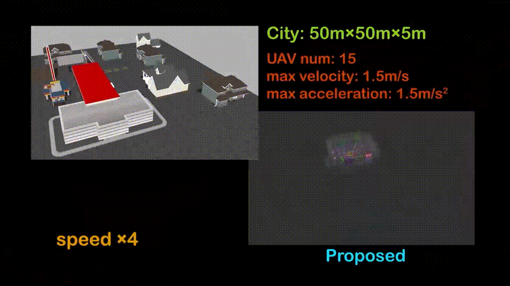
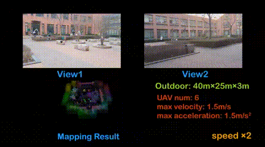

- [GVP-MREP](#GVP-MREP)
  - [Overview](#1-overview)
  - [Setup](#2-setup)
  - [Parameters](#3-parameters)
  - [Acknowledgements](#4-acknowledgements)
  - [Doing](#5-doing)


# GVP-MREP
Fast and Communication-Efficient Multi-UAV Exploration Via Voronoi Partition on Dynamic Topological Graph (IROS 2024 accepted)

# 1. Overview
**GVP-MREP** is a distributed and communication-efficient multi-UAV exploration system. For lightweight multi-UAV communication, a multi-robot dynamic topological graph (MR-DTG) is designed. Supported by MR-DTG, graph Voronoi partition (GVP) is adopted to allocate exploration tasks to each UAV. Each UAV operates GVP and optimizes trajectories to their targets distributedly.   
<p align="center">
  
  
</p>

**Video Links**: [youtube](https://www.youtube.com/watch?v=AtG9stNVjX0) or [bilibili](https://www.bilibili.com/video/BV1KC411h79h/).
<a href="https://www.youtube.com/watch?v=AtG9stNVjX0" target="blank">
    <p align="center">
        
    </p>
</a>

**Author**: [Qianli Dong (Charlie Dog)](https://github.com/charlie-dog)

**Paper**: Fast and Communication-Efficient Multi-UAV Exploration Via Voronoi Partition on Dynamic Topological Graph, Qianli Dong, Haobo Xi, Shiyong Zhang, Qingchen Bi, Tianyi Li, Ziyu Wang and Xuebo Zhang, IEEE/RSJ International Conference on Intelligent Robots and Systems (IROS), 2024, accepted.
```
@article{dong2024fast,
  title={Fast and Communication-Efficient Multi-UAV Exploration Via Voronoi Partition on Dynamic Topological Graph},
  author={Dong, Qianli and Xi, Haobo and Zhang, Shiyong and Bi, Qingchen and Li, Tianyi and Wang, Ziyu and Zhang, Xuebo},
  journal={arXiv preprint arXiv:2408.05808},
  year={2024}
}
```
# 2. Setup
This work is developed in Ubuntu 20.04, [ROS noetic](http://wiki.ros.org/noetic/Installation/Ubuntu).

**Prerequisites**:
```
$ sudo apt-get install ros-noetic-joy ros-noetic-octomap-ros python3-wstool python3-catkin-tools protobuf-compiler libgoogle-glog-dev ros-noetic-control-toolbox ros-noetic-mavros libzmqpp-dev
```

**Simulation environment**:
We adopt [RotorS](https://github.com/ethz-asl/rotors_simulator) as the simulation platform. To adapt to the scenario of multi-UAV exploration, we have made some modifications. You can get the modified version with:
```
$ mkdir -p rotors-ws/src
$ cd rotors-ws/src
$ git clone https://github.com/NKU-UAVTeam/rotors-modified.git
$ git clone https://github.com/ethz-asl/mav_comm.git
$ git clone https://github.com/catkin/catkin_simple.git
$ cd ..
$ catkin_make 

# if report error: "‘mavlink_status_t’ has not been declared", $sudo apt remove ros-noetic-mavlink. install it later

$ echo "source ~/rotors-ws/devel/setup.bash --extend" >> ~/.bashrc
```

**Clone Code and Make**:
```
$ mkdir -p GVP-MREP/src
$ cd GVP-MREP/src
$ git clone https://github.com/ethz-asl/gflags_catkin.git
$ git clone https://github.com/ethz-asl/glog_catkin.git
$ git clone https://github.com/catkin/catkin_simple.git
$ git clone https://github.com/NKU-MobFly-Robotics/GVP-MREP.git
$ cd ..
$ catkin_make
```
**Run Exploration**:
```
$ source devel/setup.bash
$ roslaunch murder_swarm murder_swarm_maze4.launch #small maze
#or
$ roslaunch murder_swarm murder_swarm_maze3.launch #large maze
#or
$ roslaunch murder_swarm murder_swarm_testcity.launch #city
```

Mamba bless your UAV!

# 3. Parameters
**Exploration Space**:
[murder_maze3.yaml](./Exploration/murder_swarm/resource/murder_maze3.yaml), [murder_maze3_ground.yaml](./Exploration/murder_swarm/resource/murder_maze3_ground.yaml) | 
[murder_maze4.yaml](./Exploration/murder_swarm/resource/murder_maze4.yaml), [murder_maze4_ground.yaml](./Exploration/murder_swarm/resource/murder_maze4_ground.yaml)
```
# exploration bounding box
Exp/minX: -20.0
Exp/minY: -20.0
Exp/minZ: 0.0
Exp/maxX: 20.0
Exp/maxY: 20.0
Exp/maxZ: 3.0

# map size (larger than the exploration bounding box)
block_map/minX: -22.5
block_map/minY: -22.5
block_map/minZ: -0.1
block_map/maxX: 22.5
block_map/maxY: 22.5
block_map/maxZ: 3.5
```
In [murder_swarm_maze3.launch](./Exploration/murder_swarm/launch/murder_swarm_maze3.launch) | [murder_swarm_maze4.launch](./Exploration/murder_swarm/launch/murder_swarm_maze4.launch).Set the number of swarm:
```xml
  <arg name="drone_num" value="10" />
```

In [murder_maze4.yaml](./Exploration/murder_swarm/resource/murder_maze3.yaml), [murder_maze3_ground.yaml](./Exploration/murder_swarm/resource/murder_maze3_ground.yaml) | 
[murder_maze4.yaml](./Exploration/murder_swarm/resource/murder_maze4.yaml), [murder_maze4_ground.yaml](./Exploration/murder_swarm/resource/murder_maze4_ground.yaml). This will cause larger communication volume. If you wanna see the explored map immediately：
``` 
block_map/vis_mode: true
```

In [murder_maze4.yaml](./Exploration/murder_swarm/resource/murder_maze3.yaml), [murder_maze3_ground.yaml](./Exploration/murder_swarm/resource/murder_maze3_ground.yaml) | 
[murder_maze4.yaml](./Exploration/murder_swarm/resource/murder_maze4.yaml), [murder_maze4_ground.yaml](./Exploration/murder_swarm/resource/murder_maze4_ground.yaml). Set the data recording path. Moreover, make sure there exists a directory: "/home/charliedog/data/swarm/maze4/MURDER/**n**" (for "n" UAVs): 
```
Computation/dir: /home/charliedog/data/swarm/maze4/MURDER
```


## 4. Acknowledgements
We use [MINCO](https://github.com/ZJU-FAST-Lab/GCOPTER.git) for trajectory planning.

## 5. Doing
The code annotation is comming soon.
